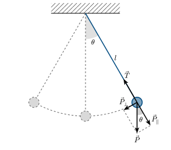

::: {.content-visible when-format="html"}
## Introdução

O pêndulo simples constitui um sistema físico fundamental para o estudo de movimentos oscilatórios, pois permite investigar de forma relativamente simples conceitos como força restauradora, período, frequência e movimento harmônico simples. Além disso, sua relação entre o período de oscilação e o comprimento do fio possibilita a determinação experimental da aceleração da gravidade, tornando-o um sistema de grande importância em atividades experimentais de Física.

::: {#fig-pendulo}


<div style="text-align: center;">
  **Fonte:** Labfis (2026)
</div>
:::

Seja uma massa $m$, considerada puntiforme, suspensa por um fio de comprimento ($l$), inextensível e de massa desprezível. Durante a oscilação, observamos duas forças atuando sobre a massa $m$: a força peso $\left(\vec{P}\right)$) e a força de tensão $\left(\vec{T}\right)$) do fio. A força peso pode ser decomposta em duas componentes: uma tangencial à trajetória da massa, responsável por gerar o movimento oscilatório, e outra radial, que atua na direção do fio. A componente radial contribui para a aceleração centrípeta da massa[^aceleracao-centripeta], enquanto a componente tangencial é responsável por sua aceleração ao longo da trajetória. A componente tangencial da força peso constitui a força restauradora $\left(\vec{P_\perp}\right)$, pois atua no sentido de retornar a massa à posição de equilíbrio. Essa força é dada por:

$$
  P_\perp = - m g \text{ sen } \theta
$${#eq-forca-restauradora}

Como essa força não é diretamente proporcional ao deslocamento angular ($\theta$), o movimento do pêndulo não é, em geral, um movimento harmônico simples. Entretanto, para pequenas amplitudes de oscilação, pode-se utilizar a aproximação $\text{sen }\theta\approx\theta$, com $\theta$ expresso em radianos[^aproximacao-theta]. Nesse caso,

$$
P_\perp = -mg \theta
$$


Aplicando a Segunda Lei de Newtone considerando que a aceleração tangencial está relacionada à aceleração angular por $a = l \alpha$, obtém-se:


$$
m l \alpha = -mg \theta \Rightarrow \alpha = -\dfrac{g}{l} \theta
$$

Como $\alpha = \dfrac{d^2 \theta}{d t^2}$, resulta:

$$
\dfrac{d^2 \theta}{d t^2} = -\dfrac{g}{l} \theta
$${#eq-edo-pendulo-simples}

Essa equação possui a mesma forma da equação diferencial do movimento harmônico simples. Portanto, a frequência angular do movimento é dada por

$$
  \omega = \sqrt{\dfrac{g}{l}}
$${#eq-freq-pendulo-simples}

Como $\omega = \dfrac{2 \pi}{T}$, o período de oscilação do pêndulo simples pode ser expressp por:

$$
  T = 2 \pi \sqrt{\dfrac{l}{g}}
$${#eq-periodo-pendulo-simples}

Essa expressão é válida para pequenas amplitudes e mostra que, nessas condições, o período depende do comprimento do pêndulo e da aceleração da gravidade, mas não depende da massa do corpo oscilante.

Neste experimento, será investigada a dependência do período de oscilação $T$ com o comprimento $l$ do pêndulo. 


## Objetivos

1. Verificar experimentalmente a relação entre o período de oscilação e o comprimento de um pêndulo simples.
2. Comparar os resultados experimentais com o modelo teórico do pêndulo simples para pequenas amplitudes.

## Material necessário


- Suporte universal;
- Fio inextensível;
- Corpo pendular;
- Régua ou trena;
- Cronômetro.

## Referências

:::{#refs}
:::

[^aceleracao-centripeta]: A aceleração centrípeta é a aceleração que mantém um corpo em movimento circular, direcionada para o centro da trajetória.

    $$
      T - m g \text{ cos } \theta = \dfrac{mv^2}{2}
    $$

[^aproximacao-theta]: Para $\theta \approx 15°$, o diferença percentual entre o ângulo $\theta$ (em rad) e $\text{sen } \theta$ é aproximadamente igual a $1,1\%$.
::::


```{=typst}

#let nonum(eq) = math.equation(block: true, numbering: none, eq)

#show bibliography: it => {
  show heading: none
  it
}

= Introdução

Conforme #cite(<Halliday2>, form: "prose"), o pêndulo simples é um sistema fundamental para o estudo de movimentos oscilatórios, permitindo investigar força restauradora, período, frequência e movimento harmônico simples. Sua relação entre período e comprimento do fio também possibilita determinar experimentalmente a aceleração da gravidade.

#figure(
  image("assets/images/typst/pendulo-simples.svg", width: 100%),
  caption: [Forças atuantes no pêndulo pimples]
)<fig-pendulo>
#align(center)[#text(size: 10pt)[Fonte: Labfis (2026)]]

Uma massa puntiforme $m$ é suspensa por um fio de comprimento $l$, inextensível e de massa desprezível (ver @fig-pendulo). Durante a oscilação, atuam sobre ela a força peso $arrow(P)$ e a tensão $T$ do fio. A força peso pode ser decomposta em componentes tangencial e radial: a primeira é responsável pelo movimento oscilatório, enquanto a segunda contribui para a aceleração centrípeta da massa#footnote[ A aceleração centrípeta é a aceleração que mantém um corpo em movimento circular, direcionada para o centro da trajetória. #nonum($ T - m g "cos" theta = (m v^2)/2 $)].

// Seja uma massa $m$, considerada puntiforme, suspensa por um fio de comprimento ($l$), inextensível e de massa desprezível. Durante a oscilação, observamos duas forças atuando sobre a massa $m$: a força peso ($arrow(P)$) e a força de tensão ($T$) do fio. A força peso pode ser decomposta em duas componentes: uma tangencial à trajetória da massa, responsável por gerar o movimento oscilatório, e outra radial, que atua na direção do fio. A componente radial contribui para a aceleração centrípeta da massa#footnote[A aceleração centrípeta é a aceleração que mantém um corpo em movimento circular, direcionada para o centro da trajetória.

// $
//   T - m g "cos" theta = (m v^2)/2
// $
// ], enquanto a componente tangencial é responsável por sua aceleração ao longo da trajetória. A componente tangencial da força peso constitui a força restauradora $arrow(P)_perp$, pois atua no sentido de retornar a massa à posição de equilíbrio. Essa força é dada por:

$
  P_perp = -m g "sen" theta
$

Como essa força não é diretamente proporcional ao deslocamento angular ($theta$), o movimento do pêndulo não é, em geral, um movimento harmônico simples. Entretanto, para pequenas amplitudes de oscilação, pode-se utilizar a aproximação $"sen" theta approx theta$, com $theta$ expresso em radianos#footnote[Para $theta approx 15°$, o diferença percentual entre o ângulo $theta$ (em rad) e $"sen" theta$ é aproximadamente igual a $1,1 %$]. Nesse caso,

$
P_perp = -m g theta
$


Aplicando a Segunda Lei de Newtone considerando que a aceleração tangencial está relacionada à aceleração angular por $a = l alpha$, obtém-se:


$
m l alpha = -m g theta arrow.double alpha = -g/l theta
$

Como $alpha = (d theta^2)/(d t^2)$, resulta:

$
  (d theta^2)/(d t^2) = - g/l theta
$

Essa equação possui a mesma forma da equação diferencial do movimento harmônico simples. Portanto, a frequência angular do movimento é dada por

$
  omega = sqrt(g/l)
$

Como $omega =  (2 pi) / T$, o período de oscilação do pêndulo simples pode ser expressp por:

$
  T = 2 pi sqrt(l / g)
$<eq-periodo-teorico>

Essa expressão é válida para pequenas amplitudes e mostra que, nessas condições, o período depende do comprimento do pêndulo e da aceleração da gravidade, mas não depende da massa do corpo oscilante.

Neste experimento, será investigada a dependência do período de oscilação $T$ com o comprimento $l$ do pêndulo. 


= Objetivos

+ Verificar experimentalmente a relação entre o período de oscilação e o comprimento de um pêndulo simples.
+ Comparar os resultados experimentais com o modelo teórico do pêndulo simples para pequenas amplitudes.

= Material necessário


- Suporte universal;
- Fio inextensível;
- Corpo pendular;
- Régua ou trena;
- Cronômetro.


= Procedimentos


+ Ajuste o comprimento do fio para $l = 0,50$ m. 

+ Desloque  a massa de seu ponto de equilíbrio (aproximadamente 5 cm) e deixe-a oscilar livremente.

+ Cronometre o tempo de 10 oascilações completas ($t$). Use a equação abaixo para calcular o valor do período observado ($T_"obs"$). Anote os valores na @tbl-coleta-dados.

  $
    T_"obs" = t /10
  $

+ Calcule o valor teórico o período $T$ (ver @eq-periodo-teorico).

+ Repita os procedimentos anteriores para todos os valores de $l$ escritos na @tbl-coleta-dados.

+ Para cada comprimento de fio da @tbl-coleta-dados, calcule o erro percentual $"Erro" (%)$ entre o valor observado e teórico do período do pêndulo. Discuta os resultados.

  $
    "Erro" (%) = (|T_"obs" - T|)/ T times 100 %
  $


#set heading(numbering: none)
= Referências

#bibliography("assets/references/references.bib", style: "assets/references/abnt.csl", title: none)

#set table(
  align: center+top
)


#place(
  bottom,
  float: true,
  scope: "parent", 
  clearance: 1.5em
)[
  #figure(
    kind: table,
    caption: [Coleta de dados],
  )[
    #table(
      columns: (0.5fr, 1.5fr, 1fr, 1fr, 1fr),
      table.header([$l$ (m)], [Tempo de 10 oscilações\ $t$ (s)], [Período Observado\ $T_"obs"$ (s)], [Período Teórico\ $T$ (s)], [$"Erro" (%)$]),
      [$0,50$], [], [], [], [],
      [$0,70$], [], [], [], [],
      //table.cell(colspan: 2)[*Média*]
    )
  ]<tbl-coleta-dados>
]
```